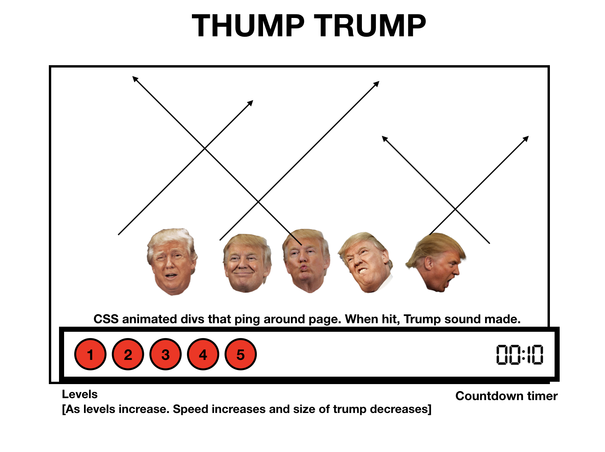

# Project 1 - General Assembly Frontend Game

##### Play Dump Trump [here](https://sophiecornish.github.io/Project1/)
##### view the project repo [here](https://github.com/sophiecornish/Project1).

###### Goal:
Demonstrate skills acquired during my first 3 weeks of coding by creating a single page web game.

###### Technologies Used:
* HTML5 + HTML5 Audio
* Javascript (ECMAScript 6) + jQuery
* Git
* Github
* Animation
* Google Fonts   

###### Game Instructions:
Click Trump to make him disappear. Watch out, if you hit Obama, it's game over - if you hit Putin, you'll get a nasty surprise!  

As you progress through the levels there's more Trumps to dump & increasingly tricky features.

###### Wireframes and Screenshots

